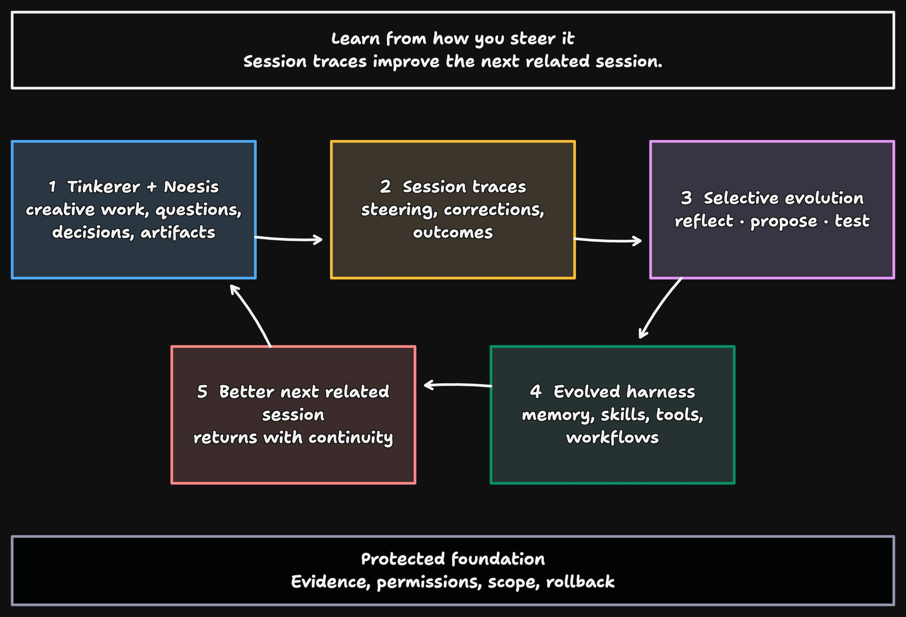

# Noesis

> The self-evolving agent harness for tinkerers.

Noesis learns how you think and work. It uses that shared experience to find better ways to help. It also helps you understand more and take on harder projects.

It is built for hackers, researchers, writers, and other curious people who move between thinking and making.



You get a result from the current turn before any learning runs. After the turn settles, Noesis reflects. Most turns change nothing. When the evidence supports it, Noesis creates or revises a Capability. Later turns can use that Capability when it is relevant. You can inspect, pause, or restore any Capability with `/learning`.

If a problem is unclear, Noesis thinks with you. If the outcome is clear, it does the work. You can change that balance in ordinary conversation.

## Capabilities

A Capability is an ability Noesis can reuse. Each version has one or more exact effects:

- **Instruction** adds trusted instructions to a matching turn.
- **Skill** exposes an instructional package that the model loads only when needed.
- **Script** uses one saved project script.
- **Workflow** uses one saved project workflow.

Script and Workflow effects use the same saved programs you create during a turn. They stay in the project that owns that definition.

New Capabilities apply anywhere they are relevant. You can narrow one to a project or session, or make it always active.

## What you can do today

- Work in a local terminal with streaming responses and visible tool activity.
- Open a new session, continue the last one, resume an older one, or fork the current session. If you type while a turn is running, those messages wait in order.
- Search previous sessions with citations. You can compact older turns without changing the transcript you see.
- Use files, directories, the shell, workflows, and session search as tools. Combine them in JavaScript with `execute`.
- Inspect the complete pre-turn session lazily in `execute`, and ask isolated models to analyze selected slices.
- Save project scripts and multi-phase workflows and reuse them.
- Connect local and remote MCP servers, including OAuth, from `/mcp`.
- Inspect what Noesis learned with `/learning`, and restore any earlier version.

Noesis is an early research preview. Its interfaces and internal design will change with use.

## Start Noesis

Noesis requires Node.js 22.19 or newer and pnpm 10.

```sh
pnpm install
pnpm start
```

The first launch asks you to choose a model and authenticate. Noesis supports OpenAI Codex, Anthropic, OpenRouter, and OpenCode Zen.

For development, install the repository-owned `noesis-dev` command:

```sh
pnpm dev:install
noesis-dev
```

The installer links `scripts/noesis-dev` into `~/.local/bin`. Set `NOESIS_DEV_BIN_DIR` to install the link elsewhere. The command runs the current checkout directly through its pinned `tsx`, works from any directory, and keeps its config, credentials, sessions, and other development state in this repository's ignored `.noesis/` directory. Run it without installing the link with `pnpm dev`.

Reopen a session:

```sh
pnpm start -- --continue
pnpm start -- --resume
pnpm start -- --resume SESSION_ID
```

`--continue` opens the most recently active session. `--resume` without an ID opens the session picker.

Project skills and project MCP servers stay disabled unless you start with `--trust-workspace`.

## Commands

| Command                                      | Result                                                                                       |
| -------------------------------------------- | -------------------------------------------------------------------------------------------- |
| `/learning`                                  | Inspect and manage Capabilities, reflection, feedback, and history.                          |
| `/mcp`                                       | Add, authenticate, inspect, enable, disable, or remove MCP servers.                          |
| `/compact [FOCUS]`                           | Compact older settled turns for future model context. The visible transcript stays complete. |
| `/context`                                   | Inspect the context for the current session.                                                 |
| `/capabilities`                              | Inspect the Capabilities selected for the current turn.                                      |
| `/skills`, `/scripts`, `/workflows`, `/runs` | Inspect those resources and their run records.                                               |
| `/fork`                                      | Create a new session from the current session.                                               |
| `/queue resume`                              | Resume a queue that you paused.                                                              |

Press `?` in the terminal for the full command and keyboard reference.

## Local state and context

Noesis stores local state under `~/.noesis/` by default. The default context budget is 160,000 tokens. Set another positive value in `~/.noesis/config.json`:

```json
{
  "schemaVersion": 1,
  "agent": {},
  "agents": {
    "provider": "openai-codex",
    "model": "gpt-5.6-sol",
    "thinkingLevel": "medium"
  },
  "context": {
    "tokenBudget": 160000
  }
}
```

The budget covers the whole model request, not only the transcript. Noesis keeps it below the selected model's context window. It also reserves room for the model's maximum output.

`/compact` writes a summary checkpoint and keeps a recent raw tail. Noesis also compacts automatically when history would exceed the budget. Resume and session search still use the original messages.

## Program over session context

Codemode exposes a lazy context view and one composable agent API:

```js
const recent = context.slice(-20000);
const answer = await agents.run({
  prompt: ["Find the unresolved decisions.", recent],
});
return answer;
```

`context` is an immutable, lazy view of the complete session before the current turn. It contains the visible messages and recorded tool, code, model, and workflow activity. Use `context.length`, `context.slice(start, end)`, or `await context.text()`.

`agents.run({ systemPrompt?, prompt, tools?, thinkingLevel? })` runs one bounded subagent. With no tools it is an isolated model query. `prompt` accepts text, a context slice, or an array of either; `tools` accepts canonical names from the frozen Tool Catalog. The default subagent route comes from `agents` in `config.json`, with omitted fields inheriting the foreground `agent` route. The parent may choose tools, prompt, and thinking level, but not the provider or model.

Subagents use the same Broker, authority, cancellation, and durable recording path as other codemode tools. Saved programs may be selected as tools, but an actual descendant `agents.run` is rejected, including indirect re-entry through Script, Workflow, or Capability program runners. A bounded `SUBAGENTS` surface stays fixed above the composer while agents are running, including across transcript navigation. Settled agents do not leave stale footer state behind. In `Ctrl+O`, selecting an `execute` run or one of its subagents restores that run's settled agents as navigable rows; use the arrow keys to select a subagent, press Space for its bounded prompt/result and child-call summaries, or Enter for the complete run inspector. The main transcript keeps one compact `subagent` row per run but suppresses its child tool calls.

Saved workflows keep the context document and model route from the run that started them, including after resume.

## Connect MCP servers

Use `/mcp` to add a local or remote server. Global servers live in `~/.noesis/mcp.json`. Project servers live in `./.noesis/mcp.json`. A project entry replaces a global entry with the same name while that project is active.

This example configures a remote OAuth server:

```json
{
  "servers": {
    "docs": {
      "type": "remote",
      "url": "https://mcp.example.com",
      "oauth": true
    }
  }
}
```

Connected MCP tools join the same catalog as built-in tools. The model can call them through `execute`, add one as a direct tool with `adapt`, or use one from a saved script or workflow.

## Trust

Generated code uses only the permissions granted for the current turn. It can save project scripts and workflows. Reflection can attach a saved program to a Capability.

Noesis asks before credential export, recovery or audit control, and irreversible external actions that you did not request in the current turn.

You can inspect every Capability, challenge it, pause it, or restore an earlier version.

## Develop Noesis

Run the complete local check before sending a change:

```sh
pnpm check
```

The check formats, lints, type-checks, and tests the repository. Tests use controlled providers and do not require paid credentials.

The checked-in VS Code workspace recommends the Oxc extension. `Format Document` uses Oxfmt, while saving runs Oxfmt followed by Oxlint's safe fixes. Both read the same repository configuration as `pnpm check`.

## Documentation

[Product documentation](docs/README.md) describes the current product and architecture. [Implementation plans](plans/README.md) record the decisions behind shipped systems. You do not need the plans to use Noesis.
