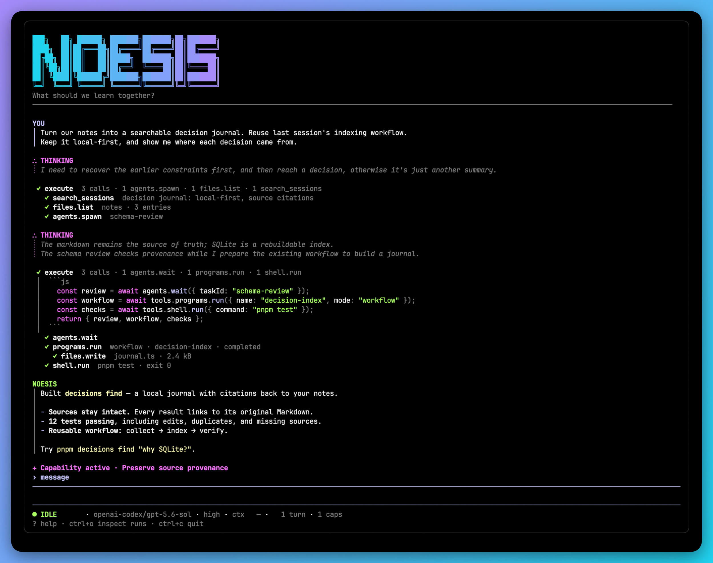
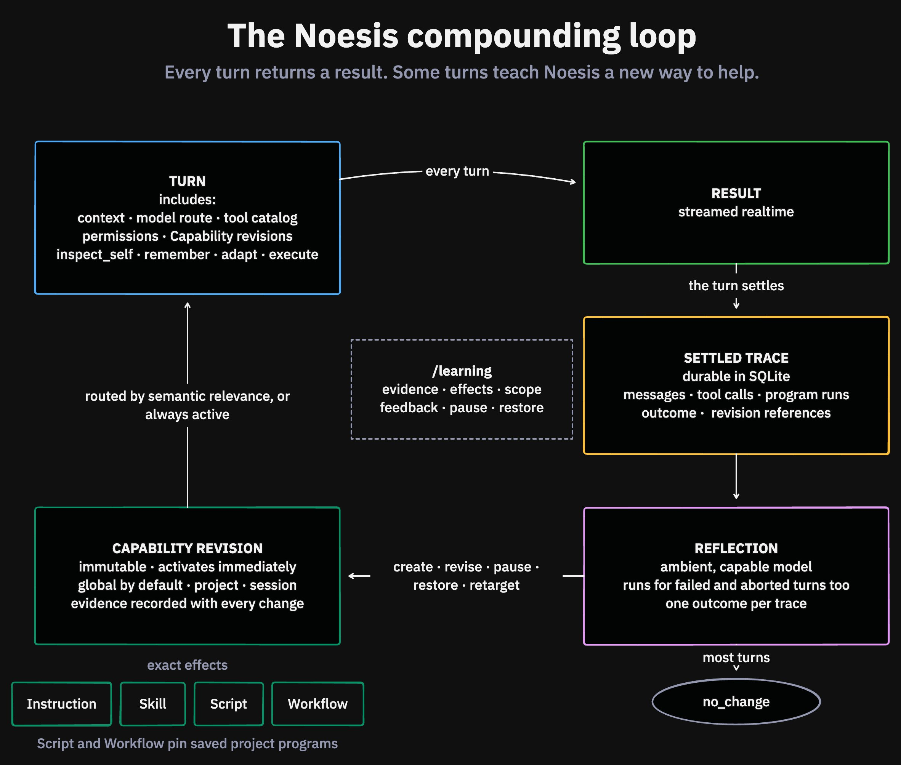

# Noesis

> The self-evolving agent harness for tinkerers.



Noesis learns how you think and work. It uses that shared experience to find better ways to help. It also helps you understand more and take on harder projects.

It is built for hackers, researchers, writers, and other curious people who move between thinking and making.

## Install Noesis

Noesis requires Node.js 22.19 or newer.

Install the public beta from npm:

```sh
npm install --global noesisai
noesis
```

The first launch asks you to choose a model and authenticate. Noesis supports OpenAI Codex, Anthropic, OpenRouter, OpenCode Zen, and OpenCode Go.

The public beta targets macOS and Linux. Start in a directory you are comfortable letting an agent inspect and modify.

See [configuration and everyday use](docs/configuration.md) for provider keys, session commands, upgrades, and MCP setup.

## What you can do today

If a problem is unclear, Noesis thinks with you. If the outcome is clear, it does the work. You can change that balance in the course of your conversation.

- Work with local files and the shell, with streaming responses and visible tool activity.
- Continue, resume, or fork sessions. Search earlier conversations with citations.
- Combine tools in JavaScript with `execute`, delegate to subagents, and save reusable scripts and workflows.
- Connect local and remote MCP servers, including OAuth, from `/mcp`.
- Inspect what Noesis learned with `/learning`, pause a Capability, or restore an earlier version.

## Compose tools and context with codemode

Noesis can write JavaScript to coordinate a task through `execute`: call tools, run independent steps in parallel, transform their results, and decide what to do next. Built-in tools and connected MCP tools can participate in the same script.

Session context is available to that code as a document. The agent can select relevant slices and give them to subagents for analysis while it continues the foreground task. This lets it work with recorded history without putting the whole transcript into every model call.

For example, it can ask a subagent to review recent context:

```js
const recent = context.slice(-20000);
const child = await agents.spawn({
  name: "decision-reviewer",
  prompt: ["Find the unresolved decisions.", recent],
});
// Continue the foreground task while the subagent runs.
return await agents.wait({ taskId: child.taskId });
```

Useful procedures can become saved project Programs: scripts to run again, or workflows that can resume from recorded progress. Their exact revisions can also become part of a learned Capability.

See [codemode, context, and subagents](docs/codemode.md) for the APIs and inspection controls.

## How learning works



You get a result from the current turn before ambient learning runs. After the turn settles, Noesis reflects. Most turns change nothing. When the evidence supports it, Noesis creates or revises a Capability. Later turns can use that Capability when it is relevant.

A Capability is an ability Noesis can reuse. Each version has one or more exact effects:

- **Instruction** adds trusted instructions to a matching turn.
- **Skill** exposes an instructional package that the model loads only when needed.
- **Program** attaches one exact saved project Program revision in script or workflow mode.

Program effects use the same saved Programs you create during a turn. They stay in the project that owns that definition.

New Capabilities apply anywhere they are relevant. You can narrow one to a project or session, or make it always active. Use `/learning` to inspect the reasoning and evidence, challenge a Capability, pause it, or restore an earlier version.

## Commands

| Command                                               | Result                                                                                       |
| ----------------------------------------------------- | -------------------------------------------------------------------------------------------- |
| `/learning`                                           | Inspect and manage Capabilities, reflection, feedback, and history.                          |
| `/mcp`                                                | Add, authenticate, inspect, enable, disable, or remove MCP servers.                          |
| `/compact [FOCUS]`                                    | Compact older settled turns for future model context. The visible transcript stays complete. |
| `/context`                                            | Inspect the context for the current session.                                                 |
| `/capabilities`                                       | Inspect the Capabilities selected for the current turn.                                      |
| `/skills`, `/programs`, `/program MODE NAME`, `/runs` | Inspect instructional resources, Programs, and run records.                                  |
| `/fork`                                               | Create a new session from the current session.                                               |
| `/queue resume`                                       | Resume a queue that you paused.                                                              |

Press `?` in the terminal for the full command and keyboard reference.

## Public beta and trust

The `0.0.x` releases are a public beta. Noesis is intended for macOS and Linux terminals; Windows is not yet part of the release test matrix. Commands, configuration, and durable schemas may change before `1.0`, with migrations supplied for persisted state.

Noesis runs with the file-system and terminal access of its process. Workspace-selected skills and MCP servers require `--trust-workspace`, but direct file and shell work can still affect anything the process can access. Generated code uses the permissions granted for the current turn.

Noesis asks before credential export, recovery or audit control, and irreversible external actions that you did not request in the current turn.

Noesis contacts the model providers and MCP servers you configure, refresh compatible model metadata from `pi.dev`, and let the agent fetch HTTP or HTTPS URLs through its web tool. Those services and sites have their own data policies, and model providers may charge for usage.

Report bugs and beta feedback through [GitHub Issues](https://github.com/SwarnimWalavalkar/noesis/issues). Report security problems privately as described in [SECURITY.md](SECURITY.md).

## Configuration and advanced usage

Noesis keeps local state in `~/.noesis/` by default. Its default context budget is 160,000 tokens. Automatic compaction preserves the original transcript for resume and session search.

- [Configuration and everyday use](docs/configuration.md) covers models, provider keys, context budgets, sessions, MCP servers, upgrades, and uninstalling.
- [Codemode, context, and subagents](docs/codemode.md) describes tool composition, the context API, agent lifecycle, and inspection.

## Develop Noesis

Development requires pnpm 10. Install the repository and start its source build with:

```sh
pnpm install
pnpm start
```

For regular local testing, install the repository-owned `noesis-dev` command:

```sh
pnpm dev:install
noesis-dev
```

The installer links `scripts/noesis-dev` into `~/.local/bin`. Set `NOESIS_DEV_BIN_DIR` to install the link elsewhere. The command runs the current checkout directly through its pinned `tsx`, works from any directory, and keeps its config, credentials, sessions, and other development state in this repository's ignored `.noesis/` directory. Run it without installing the link with `pnpm dev`.

Run the complete local check before sending a change:

```sh
pnpm check
```

The check verifies formatting, lints, type-checks, and tests the repository. Tests use controlled providers and do not require paid credentials.

The checked-in VS Code workspace recommends the Oxc extension. `Format Document` uses Oxfmt, while saving runs Oxfmt followed by Oxlint's safe fixes. Both read the same repository configuration as `pnpm check`.

Maintainers publish new npm versions by [creating a GitHub release](docs/releases.md). The release workflow tests and publishes the same package archive through npm trusted publishing.

## Documentation

[Product documentation](docs/README.md) describes the current product and architecture. [Implementation plans](plans/README.md) record the decisions behind shipped systems. You do not need the plans to use Noesis.
