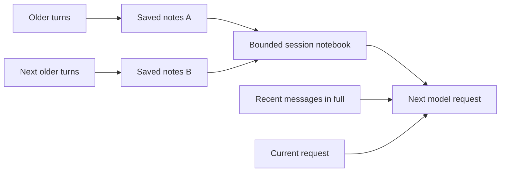

# Long sessions and compaction

Noesis lets you continue a long session with a smaller amount of conversation in each model request. It keeps recent messages in full and records continuity notes from older work. Your original transcript remains available for inspection and search.

Automatic compaction is enabled by default. You can also run `/compact` when you want to make room before continuing.

## Notes that stay unchanged

A common way to compact a conversation is to combine the previous summary with new messages and summarize both again. Over many compactions, an early decision can pass through several rewrites. Each rewrite is another opportunity to lose its wording or qualification.

Noesis writes independent notes from each newly covered portion of the conversation. Once saved, those notes stay unchanged. The next compaction reads only the next portion of original conversation, without the earlier notes. In the implementation, each new set of notes is called a `note_delta`.



The model extracts notes about decisions and anything needed to continue the work. These can include a constraint, an unfinished task, or an exact file or command reference. Compaction covers whole settled turns. Failed and aborted turns keep their unfinished status.

For example, suppose you decide to keep a database migration reversible, then spend many turns implementing it. The notes from the decision stay unchanged through later compactions. If you later change that requirement, Noesis can record the correction in a new note. When the exact reasoning matters, it can search the original exchange.

## What the model sees next

For each new turn, Noesis assembles a session notebook from the newest consecutive sets of notes that fit its budget. It presents them in chronological order alongside recent messages and your current request. This notebook is bounded, so it does not grow to include every note from an indefinitely long session.

The notebook uses at most one quarter of the available history budget, capped at 8,000 estimated tokens. The history budget is what remains after reserving space for the rest of the request. See [context configuration](configuration.md#configure-models-and-context) for the complete budget rules.

When older notes no longer fit, the notebook reports how many earlier note windows were omitted. Those notes and the original conversation remain stored. Noesis selects resident notes by recency and budget; it does not run a relevance search at every compaction.

The exact notes and recent messages selected for a turn are recorded with content digests. You can inspect what was supplied, including after resuming a session. Notes are labelled as reference material. An old request inside a note does not become a new instruction to act.

## Why this can help

| Design choice                                                      | Benefit during a long session                                                      |
| ------------------------------------------------------------------ | ---------------------------------------------------------------------------------- |
| Earlier notes are never summarized again.                          | An existing note cannot lose detail through another compaction rewrite.            |
| Each compaction reads only newly covered conversation.             | You avoid paying to process and rewrite the accumulated notes on every compaction. |
| Only a bounded notebook and recent messages enter future requests. | You send less historical text than replaying the entire growing conversation.      |
| Original messages and tool traces remain searchable.               | Noesis can look up an exact result when a short note is insufficient.              |

This is useful when work spans many turns and you occasionally need to revisit an earlier decision or error. You can keep working in the same session and ask for the original evidence when needed.

The cost benefit comes from reducing repeated work. Compaction itself requires model calls, and retrieving omitted details can add work later. Total savings depend on the length of the session, how often details are retrieved, and provider pricing. Cost and answer quality improvements still need benchmarking.

Unchanged note text also avoids one source of prompt changes that can interfere with provider caching. It does not guarantee a cache hit. Adding or dropping note windows changes the request, and other prompt content can change too. Use `/context` to see the last request's reported cache hit rate; the component token estimates are not a billing report.

## Use it in a session

You can let automatic compaction run before a new turn whenever eligible history exceeds its allocation. For manual control, wait for the active turn to settle, then run:

```text
/compact
```

You can provide a focus for the new notes, e.g.:

```text
/compact Preserve the migration constraints and remaining verification work.
```

The focus guides extraction from newly covered work. It does not rewrite existing notes.

Open `/context` and select the session notebook section to preview it. You can also inspect the space used by recent conversation and other parts of the request.

If an earlier detail is missing, ask in the conversation, e.g. "Search this session for the original migration error and quote the relevant output." Noesis can search current-session evidence with citations. Advanced users can find the tool and scope details in [codemode and session history](codemode.md#retrieve-older-session-details).

To disable automatic compaction, set `context.autoCompact` to `false` in `~/.noesis/config.json` and restart Noesis. Existing notebooks remain in use and manual `/compact` remains available. An over-budget turn stops with guidance instead of silently dropping history.

## What compaction preserves

The original transcript stays complete, but continuity notes are selective. A note can omit or misstate something on its first extraction, and an older note may leave the bounded notebook. Search is available when you need the source; a bounded search is not a guarantee that every relevant detail will be found.

If you reduce the context budget so far that the newest saved note no longer fits, `/compact` cannot shrink that immutable note. Increase `context.tokenBudget` or shorten the new request, within the selected model's capacity.

Continuity notes belong to the session. They do not create learned Capabilities or change model weights. [Capability learning](../README.md#how-learning-works) is the separate process for adapting how Noesis helps across future tasks.

See [the architecture reference](agent-intelligence-and-experience.md#context-budget-and-compaction) for checkpoint validation and recovery behavior.
